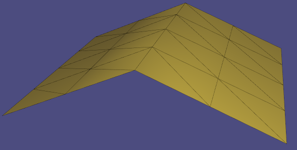

# Assignment 1
Name: Gueddach Noureddine

Legi-Nr: 18-804-880

## Required results
Edit this 'README.md' file to report all your results. You only need to update the tables in the reports section by adding screenshots and reporting results.

### Tasks
- Add a text dump of the content of the two data structures for the provided mesh “plane.off”.

- Show three screenshots of the 'fandisk.off' model using 'per-face shading', 'per-vertex shading' and 'per-corner shading'. Describe the difference between them.

- Show screenshots of the provided meshes with each connected component colored differently. Show the number of connected components and the size of each component (measured in number of faces) for all the provided models.

- Show screenshots of the subdivided meshes.

## Reports
### text dump of the data structure for "plane.off"
|Vertices-to-Face                  | Vertices-to-Vertex                 |
| :------------------------------- |:---------------------------------- |
| faces for v0: 5 21               | vertices for v0: 11 13 22          |
| faces for v1: 31                 | vertices for v1: 9 12              |
| faces for v2: 10 26              | vertices for v2: 10 15 23          |
| faces for v3: 0                  | vertices for v3: 14 16             |
| faces for v4: 14 27 30           | vertices for v4: 9 10 20 24        |
| faces for v5: 13 23 29           | vertices for v5: 11 12 19 24       |
| faces for v6: 1 4 17             | vertices for v6: 13 14 18 21       |
| faces for v7: 2 8 18             | vertices for v7: 15 16 17 21       |
| faces for v8: 6 9 12 19 22 25    | vertices for v8: 17 18 19 20 22 23 |
| faces for v9: 15 30 31           | vertices for v9: 1 4 12 24         |
| faces for v10: 11 26 27          | vertices for v10: 2 4 20 23        |
| faces for v11: 7 21 23           | vertices for v11: 0 5 19 22        |
| faces for v12: 15 29 31          | vertices for v12: 1 5 9 24         |
| faces for v13: 4 5 20            | vertices for v13: 0 6 18 22        |
| faces for v14: 0 1 16            | vertices for v14: 3 6 16 21        |
| faces for v15: 8 10 24           | vertices for v15: 2 7 17 23        |
| faces for v16: 0 2 16            | vertices for v16: 3 7 14 21        |
| faces for v17: 3 8 9 18 19 24    | vertices for v17: 7 8 15 18 21 23  |
| faces for v18: 3 4 6 17 19 20    | vertices for v18: 6 8 13 17 21 22  |
| faces for v19: 7 12 13 22 23 28  | vertices for v19: 5 8 11 20 22 24  |
| faces for v20: 11 12 14 25 27 28 | vertices for v20: 4 8 10 19 23 24  |
| faces for v21: 1 2 3 16 17 18    | vertices for v21: 6 7 14 16 17 18  |
| faces for v22: 5 6 7 20 21 22    | vertices for v22: 0 8 11 13 18 19  |
| faces for v23: 9 10 11 24 25 26  | vertices for v23: 2 8 10 15 17 20  |
| faces for v24: 13 14 15 28 29 30 | vertices for v24: 4 5 9 12 19 20   |

 
 
 

 
 
 

### Show three screenshots of the 'fandisk.off' model using different shading. Make sure you disable the wireframe and that the screenshots clearly show the differences between the different shading types.
| model name  | per-face shading    | per-vertex shading |  per-corner shading |
| :---------: | ------------------- | ------------------ | ------------------- |
| fandisk     ||  |  |

#### Briefly describe the difference between the different shading types.
The face shading does not give any smoothness illusion and the underling mesh faces are well visible. On the opposite end, per-vertex shading smoothes out everything, even sharp corner that shouldn't be smoothed, making the corners look really off, with some artifacts sometimes.
per-corner shading takes the best of both worlds, smoothing everything but corners that are above a certain threshold, giving nice visuals. The used threshold was 30°.

### Assign different colors to each connected component
| model name   | your results                                             |  no. of components | no. of faces per component |
| :----------: | -------------------------------------------------------  |:-----------------: | :------------------------: |
|bumpy_cube    |  |   1                |  2496                      |
|bunny         |  |   1                |  27864                     |
|coffeecup     | |   2                |  3360/2304                 |
|honda         |  |   11               |  90/192/192/13216/704/1088/1088/1088/1088/736/736                 |

### Screenshots of subdivided meshes. Make sure you enable the wireframe overlay.

| model name | original shape                                           | subdivided shape                                         |
| :--------: | -------------------------------------------------------- |--------------------------------------------------------- | 
| plane      |  |  |
| sphere     | | |
| bunny      |  |  |
| bumpy_cube |  |  |

