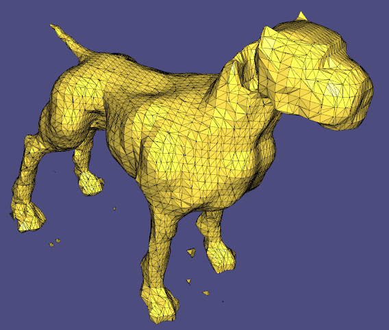

# Assignment 2

## Report
### 1 - Visualization of the 'cat.off' point cloud with constrained points
| model name  | view 01             | view 02            |
| :---------: | ------------------- | ------------------ |
| cat         ||  |

### 2 - Grid with nodes colored w.r.t. the implicit function (using the non-axis-aligned grid as described in Section 2.3) 
| model name  | view 01             | view 02            |
| :---------: | ------------------- | ------------------ |
| cat         ||  |
| luigi      ||  |

### 3 - Reconstructed surfaces

| sphere                                                     | cat                                                           |
| :--------------------------------------------------------: |  :----------------------------------------------------------: | 
||  |
| luigi                                                      | horse                                                         |
||  |
| hound                                                      |                                                               |
||                                                               |

| params                   | Your Observation    | 
| :---------------------:  | ------------------- |
| grid resolution          |   As one might expect, increasing the resolution increases computation time as we evalute the implicit function at more points, but also highly increases the level of detail. For some shapes like 'hound' or 'horse', it is beneficial to use anisotropic resolution as some the meshes are much longer in some dimensions than others. We can also notice that increasing the resolution too much increases the artificats around the mesh (which could in principle easily be removed using a largest connected component approach) |
| Wendland function radius |   Increasing the wendland radius yields much smoother reconstructions and takes significantly more time (as the neighborhood is larger for each point). It also helps getting rid of unwanted artifacts. Decreasing the radius gives coarser reconstructions and is much faster. |
| polynomial degree        |   Increasing the polynomial degree seems to overall give smoother curvature without removing the local details, at the cost of a bit longer computational time as well as a huge amount of artifacts around the mesh (but at a 'safe' distance, this distance being the wendland radius). Again, these can easily be removed using a connected components approach. |

**Times are reported in microseconds:**
| step                    | brute force         |  spatial index      |
| :---------------------: | :-----------------: | :-----------------: |
| constraints             |   409314              |    14320             |
| MLS                     |   829572              |    366128             |

We see that the spatial index greatly increases performance. The change is not so dramtic in the MLS case because a fair amount of time is spent solving the linear system, which is independent from how we got the data (using spatial index or bruteforce). 

**Visual comparision between the different parameteres set to low and high:**
| params  | low             | high            |
| :---------: | ------------------- | ------------------ |
| resolution  ||  |
| wendland radius  ||  |
| polynomial degree ||  |

### 4 - Theory 1

**Proof that the normal of a surface defined by an implicit function is proportional to its gradient.**

[Question 1](./docs/question1.pdf)

### 5 - Theory 2

**Gradient of the MLS approximation.**

[Question 2](./docs/question2.pdf)

### 6 - Normal-based v.s. point-based reconstruction ("hound.off")
| method       | view 01             | view 02            | comments           | 
| :---------:  | ------------------- | ------------------ | ------------------ |
| point-based  ||  | We can see that the point-based method tends to remove some important details like the ears and tail. |
| normal-based ||  | The normal-based method on the hand manages to preserves these details. |

### 7 - MLS v.s. Screened Poisson Reconstruction v.s. RIMLS

**Comparison with [Meshlab](https://www.meshlab.net).**

| model names  | MLS          | Possion             | RIMLS               | 
| :---------:  | :---------:  | :-----------------: | :-----------------: |
| cat          ||  | |
| luigi        ||  | |
| comments        | As MLS reconstructs smooth surfaces, it struggles with sharp features. While the models are mostly well reconstructed, we have on the one hand an artifact problem, and (especially for luigi) MLS tends to poorly reconstruct the mesh in places situated between 2 surfaces like between the legs or at the armpits level. | The results obtained with Poisson reconstruction are excellent and in addition, the reconstruction is very fast. This is due to the multiresolution implemented using an octree data structure allowing to concentrate sampling at points near the surface. This can for example be seen in the resolution difference between noise and the torso | RIMLS aims to be a robust version of MLS meaning it is less distrubed by noise). Indeed, it is clear that this is the method that best preserves the features by not attributing them to random noise. As an example, it is the method that best reconstructs luigi's hat. It however seems to fail at the cat's elbow. |

### 8 - PCA normals v.s. provided normals (luigi.off)

| model names  | PCA normals             |  Provided normals       | 
| :---------:  | :---------------------: | :---------------------: |
| luigi        |  |  |
| comments        | While it does mostly pretty good on most of the mesh, PCA has some trouble computing appropriate normals for areas with high curvature, for example at the ears of the cap. This makes sense since evidently the mesh is not flat at this point and cannot appropriately be approximated by a plane, which is the assumption PCA makes. | Using the provided normals on the other hand does not summer from the same problem, as the correct normals are provided also for areas of the mesh with high curvature. |

### 9 - Extra: explanation for the artifacts:

Since artifacts are one of the biggest problems in this assignment, here is the explanation that I came up with, especially considering that they usually appear at some fixed distance from the mesh, increasing proportionally to the wendland radius. Consider a point P at distance r = wendland radius from the surface. At this distance, the neighborhood of the said is typically very sparse but not empty, it might contain say 1 or 2 points. With these few points, it is not possible to distinguish if we are on the 'inside' or 'outside' of the mesh and hence some evaluated points are assigned a positive and some others a negative value. Naturally, the marching cubes algorithms then infers that there should be a triangle at this position, which leads to the visual artifacts. At larger distances, the neighborhood is empty and so the points are set to be outside the mesh by default. At smaller distances, the neighborhood is dense enough to infer whether we are inside or outside the mesh.

### 10 - Extra: Cleaning the mesh with connected components:
As mentioned earlier, we can get rid of the artifacts using the connected components algorithm. Note that throughout the report I did not use this option for any of the reported results, but I figured it was a nice addition to have this here. In the following table you can see luigi with and without connected components using a quadratic basis (the higher the degree the more artifacts we get):

| model names  | without postprocessing  |  with connected components       | 
| :---------:  | :---------------------: | :---------------------: |
| luigi        |  |  |
