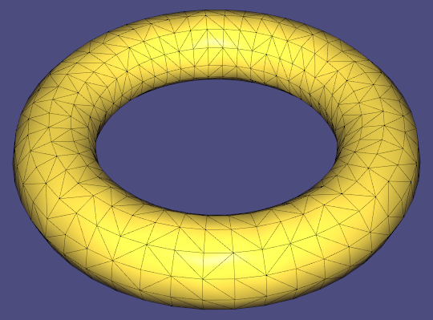

# Assignment 3

Name: 'Noureddine Gueddach'

Legi-Nr: '18-804-880'

## Required results
Edit this 'README.md' file to report all your results. You only need to update the tables in the reports section by adding screenshots and reporting results.

### Mandatory Tasks
1) Show the screenshots of mesh **torus.obj** and the mesh **Julius.obj** from the data folder shaded with the 5 different normals. For the PCA and quadratic fitted normals show them each with both k=1 and k=2. Note that here k means k-ring neighbors.

2) Report your matching between curvature expressions and the figures. Provide a short motivation for your matchings.

3) Show screenshots of mesh **bumpy-cube.obj** from the data folder coloured according to the 4 discrete curvature measures.

4) Report your findings on the differences between implicit and explicit Laplacian smoothing, the differences between uniform vs cotangent weights and report the parameters you used and how changing them affects the result. Also show screenshots of both the implicit and explicit Laplacian smoothing results for mesh **bunny_noise.obj** from the data folder.

5) Report your findings on the comparison with results you obtained with the Laplacian smoothing vs with bilateral smoothing. Show screenshots of bilateral smoothing applied to mesh **bunny_noise.obj** from the data folder.

## Reports
### 1 - Shading w.r.t. different normals

**Use the mesh torus.obj and the mesh Julius.obj**

**Use the built-in function igl::per_vertex_normals() to orient your normals consistently**

| normals        | torus.obj                  | Julius.obj                 |
| :-----------:  | ------------------------------------- |------------------------------------- |
| standard       ||  |
| area-weighted  ||  |
| mean-curvature ||  |
| PCA (k=1)      ||  |
| PCA (k=2)      ||  |
| quadratic (k=1)||  |
| quadratic (k=2) ||  |

### 2 - Matching curvature expressions and the figures
| expression   |  Your answer |  Your explanation   |
|--------------|--------------|------------------|
| k1           | d      | The curvature is never zero (no part of the curve is ever flat)            |
| k2           | c      | Half of the curve has negative curvature (s < 0) and the second half has positive curvature (s > 0)            |
| k3           | a      | Curvature does not change signs and the lower part of the curve is flat (contrary to (d))            |
| k4           | b      | The curve starts with a positive curvature, then the curvature becomes negative at the pear-shaped part of the curve, before getting positive again at the other end. Indeed this quadratic is convex and has 2 zeros (<=> 2 sign flips of the curvature)            |

### 3 - Visualize curvatures

**Use the mesh bumpy-cube.obj**

| Min Curvature                         |  Max Curvature                       |
| ------------------------------------- |------------------------------------- |
||  |
| Mean Curvature                        |  Gaussian Curvature                  |
||  |

**Please note that these are implemented from scratch and are not using the provided one-liner libigl functions. (except for displaying the curvature vectors for the min and max curvature). I tried with the provided libigl functions and it seems to me that the difference simply stems from the color nomralization. I thought it would be more interesting and insightful to code it instead of just calling some function.**

### 4 - Implicit v.s. explicit Laplacian Smoothing

**Use the mesh bunny_noise.obj**

**Try different laplacian matrices, step sizes and iterations**

| Input  |  Implicit (delta=e-3, 1 iter)    |  Implicit (delta=e-4, 1 iter)          | Implicit (delta=e-4, 3 iter)          |
| -------|----------------------------- |------------------------------------|---------------------------------- |
||  | | |

**Observations:** Implicit smoothing is extremely fast as it only requires 1 iteratioon, achieving great results. We notice that by choosing delta a bit smaller, we preserve a lot more detail but the surface is not as smooth. To get a smoother surface we can reiterate the smoothing a few times (here done 3 times), which achieves similar smoothing performance, while preserving a bit more detail than the one-shot smoothing.

Not shown here but taking delta even smaller will make it hard for the algorithm to converge.

Another observation is that applying smoothing (repetitively) tends to shrink the surface.

| Input  |  Uniform (lambda=e-2, 150 iter)    |  Cotan (lambda=e-5, 20 iter)          | Cotan (lambda=e-6, 200 iter)          |
| -------|----------------------------- |------------------------------------|---------------------------------- |
||  | | |

**Observations:** First thing to notice is that explicit smoothing is orders of magnitude slower than implicit smoothing, while performing typically worse.

Using the Uniform Laplacian, it's quite complicated to get good results, as it smoothes out a lot of the details that should be preserved (refer to the 'i' on the picture above). Performing fewer iterations tends to leave out a lot of noise. Choosing lambda to be smaller makes the convergence extremely slow.

Using the Cotan Laplacian, the results are way better, as more detail is preserved. Even with a modest amount of iterations (20), we get results that preserve most of the details while smoothing out most of the noise. We can decrease lambda even more and perform an order of magnitude more iterations to achieve similar detail preservation performance as the implicit smoothing (maybe even slightly better?), but at a much larger computational cost.

Another thing to notice is that explicit smoothing tends to produce 'spikes' at the boundaries of the mesh, whereas implictly smoothed boundaries remain smooth.

### 5 - Laplacian v.s. bilateral smoothing

**Use the mesh bunny_noise.obj**

| Input                                 |  Laplacian (lambda=e-4, 3 iter)                 |  Bilateral (K=2, 5 iter, s_c=0.01, s_s=0.5)                 |
| ------------------------------------- |------------------------------------- |------------------------------------- |
||  | |

**Observations:** Bilateral smoothing achieves similar performance to implicit Laplacian smoothing. One key distinction is that Bilateral smoothing 'agressively' preserves sharp features. It's even complicated to smooth them, as it even accentuates them (with almost any parameter configuration than I tried). This may be desirable in some cases, but the sharp features tend to become a bit jittery at times (on the contour of the 'i' for example). It also has slightly more parameters, which can be positive but also harder to tune.
