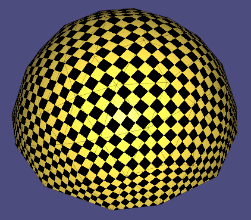
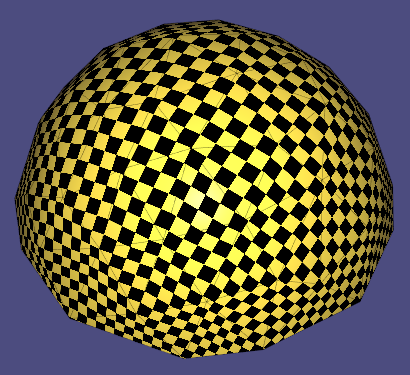
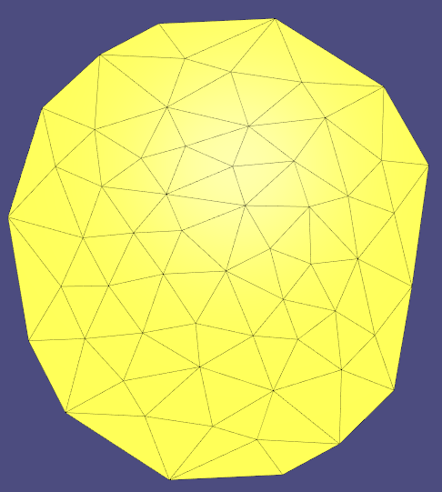
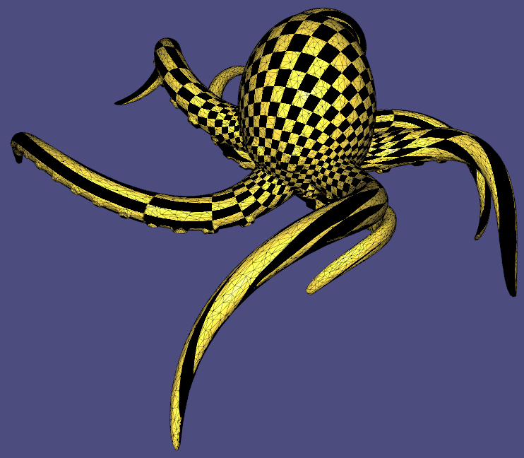
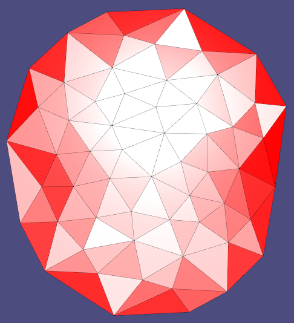

# Assignment 4

## Reports
### Pparameterization and checkerboard texture models
#### *cathead*
| Method            | checkerboard textured models          |         Parameterization             |
| :--------------:  | ------------------------------------- |------------------------------------- |
| Uniform (fixed)   ||  |
| Cotangent (fixed) ||  |
| LSCM (fixed)      ||  |
| ARAP (fixed)      ||  |
| LSCM (free)       ||  |
| ARAP (free)       ||  |

#### *hemisphere*
| Method            | checkerboard textured models          |         Parameterization             |
| :--------------:  | ------------------------------------- |------------------------------------- |
| Uniform (fixed)   ||  |
| Cotangent (fixed) ||  |
| LSCM (fixed)      ||  |
| ARAP (fixed)      ||  |
| LSCM (free)       ||  |
| ARAP (free)       ||  |

#### *hemisphere_non_convex_boundary*
| Method            | checkerboard textured models          |         Parameterization             |
| :--------------:  | ------------------------------------- |------------------------------------- |
| Uniform (fixed)   ||  |
| Cotangent (fixed) ||  |
| LSCM (fixed)      ||  |
| ARAP (fixed)      ||  |
| LSCM (free)       ||  |
| ARAP (free)       ||  |

#### *Octo_cut2*
| Method            | checkerboard textured models          |         Parameterization             |
| :--------------:  | ------------------------------------- |------------------------------------- |
| Uniform (fixed)   ||  |
| Cotangent (fixed) ||  |
| LSCM (fixed)      ||  |
| ARAP (fixed)      ||  |
| LSCM (free)       ||  |
| ARAP (free)       ||  |

### distortion visualization
#### *cathead*
| mtd \ metric      | Conformal (angle) |    Authalic (area)  |  Isometric  (length)    |
| :--------------:  | ----------------- | ------------------- | ----------------------- |
| LSCM (free)       ||  |  |
| ARAP (free) ||  | |

#### *hemisphere*
| mtd \ metric      | Conformal (angle) |    Authalic (area)  |  Isometric  (length)    |
| :--------------:  | ----------------- | ------------------- | ----------------------- |
| LSCM (free)       ||  |  |
| ARAP (free) ||  | |

### Extra
I used various strategies for computing the fixed points:
   
   1. Compute the geodesic distances using dijkstra (brute force)
   2. Compute the euclidean distances by brute force
   3. Same as (1.) but perform Monte Carlo sampling instead of brute force, as it gets prohibitively slow for large meshes
   4. **Iterative geodesic distances:** Start with some point, perform dijkstra to get the farthest point, set the found point as the new source for dijkstra and reiterate a given number of times. This does not converge to the optimal solution but is very fast and works nicely for large meshes, but not so well for smaller ones.
   5. **Iterative MC geodesic distances:** Combines Monte Carlo and previous approach as follows: Sample a random point, perform dijsktra, get the farthest point and do 1 more dijkstra to get the new farthest point. This is very fast and works extremely well in practice as it seems to find the maximum distance vertices with very high probability emprically.
