# Assignment 5

## Reports
### 1.1 - 1.4 Multiresolution Mesh Editing
| model name     | S     |  B    |  B'   |  S'   |
| :-----------:  | ----- | ----- | ----- | ----- |
| woody-lo       |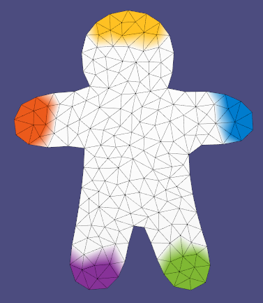|  |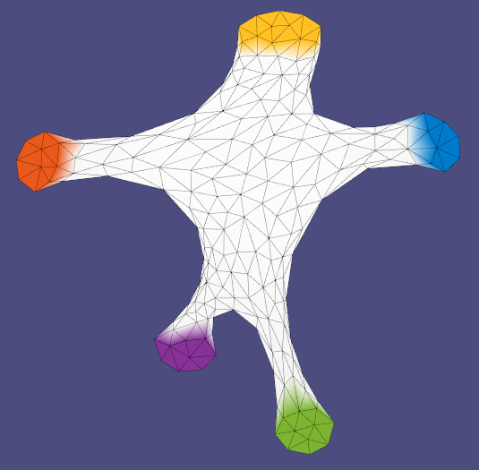|  |
| woody-hi       |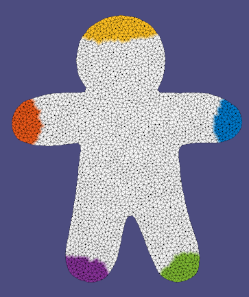| 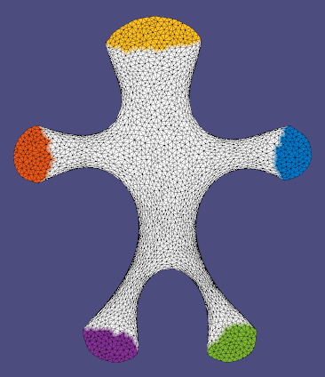 |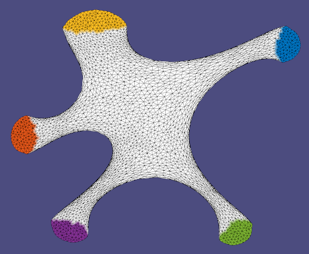| 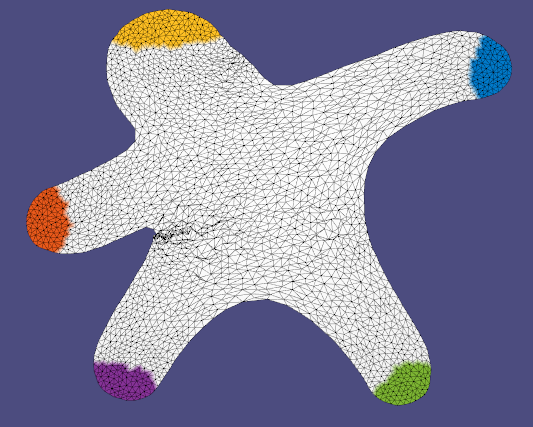 |
| hand           |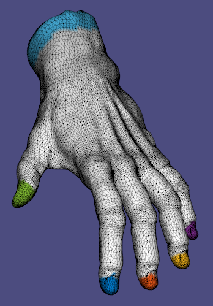|  |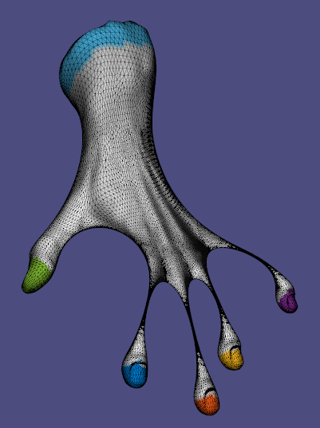| 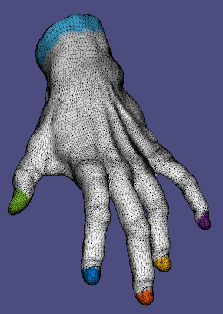 |
| cylinder       |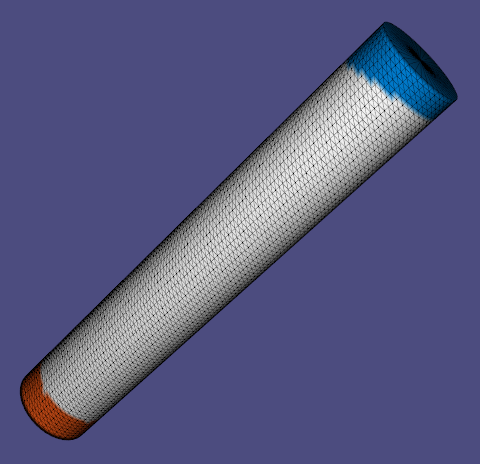| 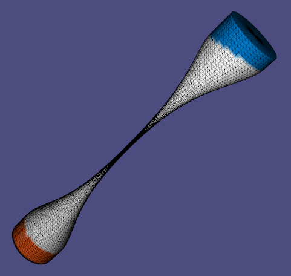 |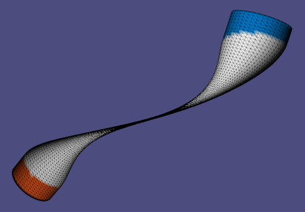| 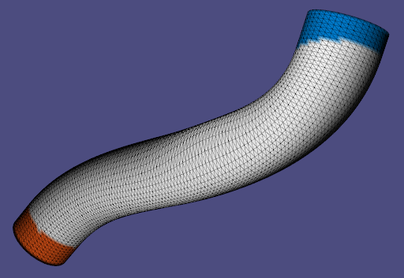 |

### 1.5 Real time mesh editing

| model name     |   S' - real time   |
| :-----------:  | -----  |
| bar            | 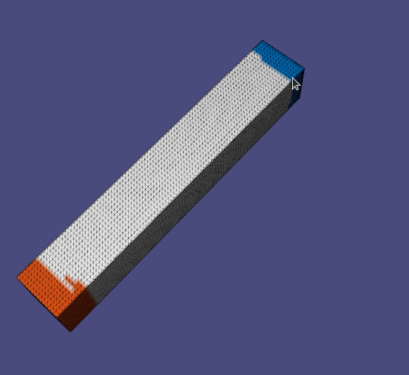 |
| bumpy_plane    |  |
| camel_head     | 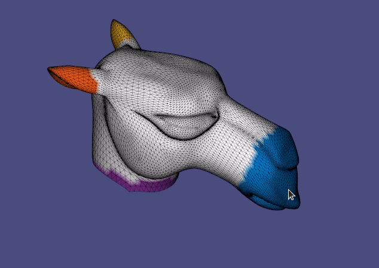 |
| cactus         | 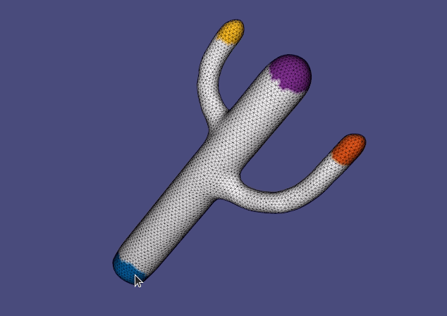 |

### 2 Deformation transfer
| model name     | High-freq detail transfer             | Deformation transfer                 |
| :-----------:  | ------------------------------------- |------------------------------------- |
| bar            |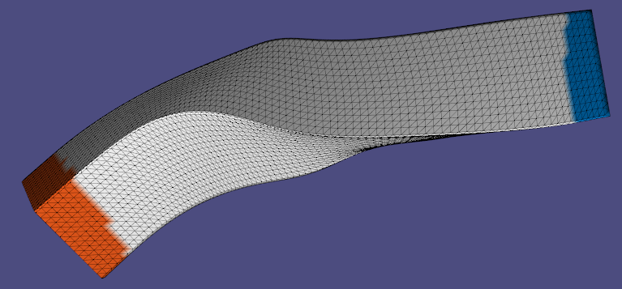| 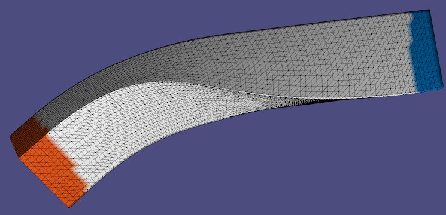 |
| bumpy_plane    |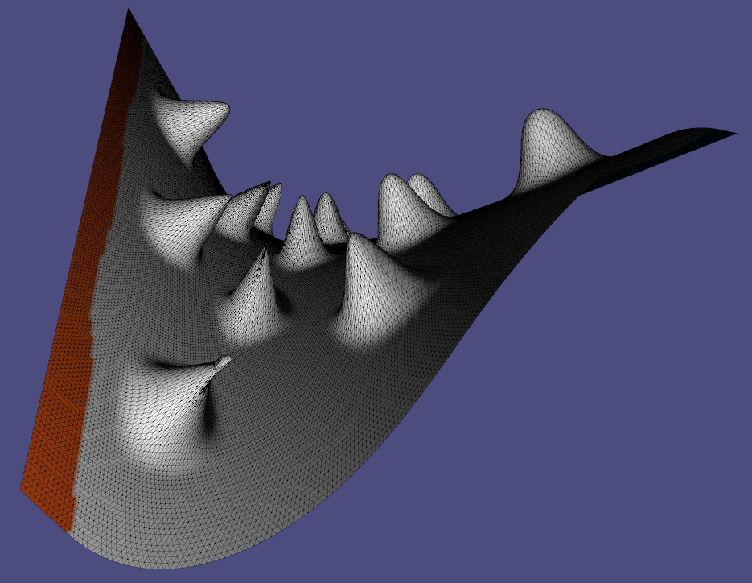| 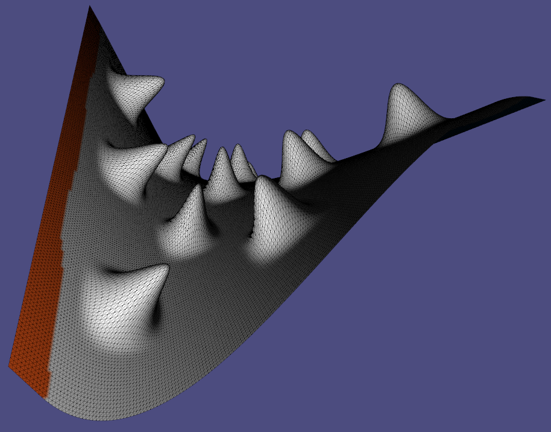 |
| camel_head     |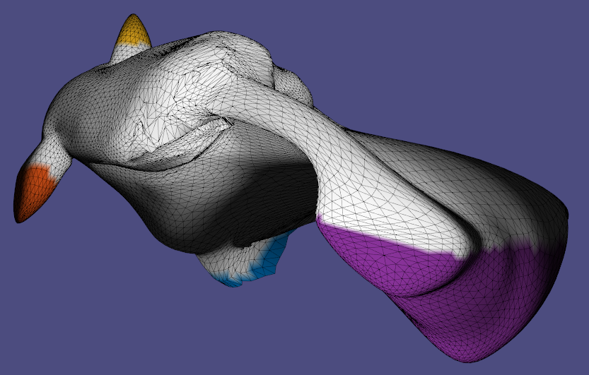| 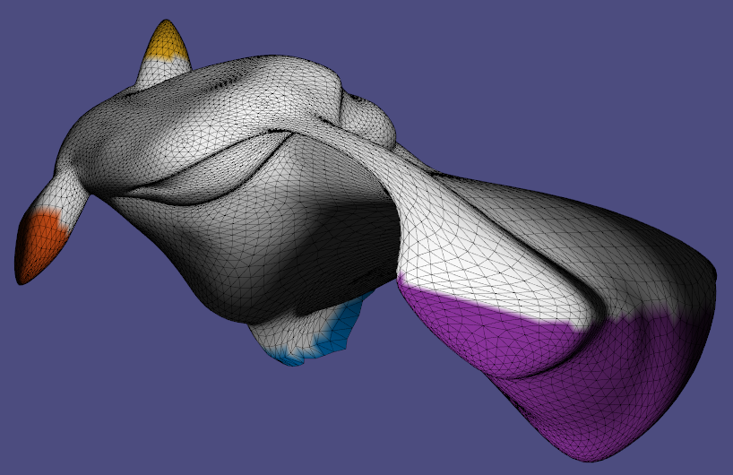 |
| cactus         |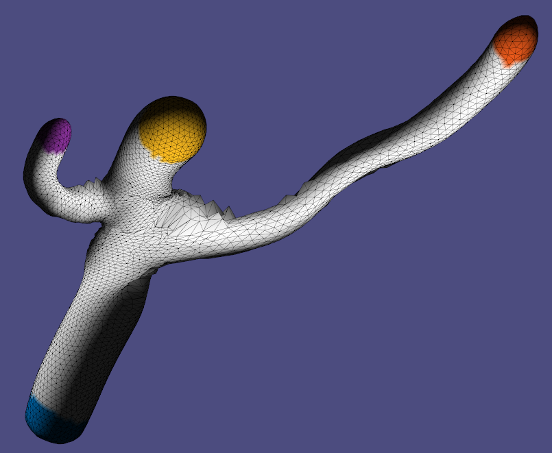| 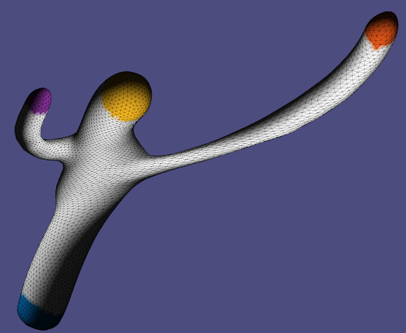 |

#### Observations

|      | High-freq detail transfer             | Deformation transfer                 |
| :-----------:  | ------------------------------------- |------------------------------------- |
| Your Comments  |High-freq detail transfer tends to produce self-intersections (as can be seen in the bumpy plane), some weird curvatures (as can be seen in the bar and the cactus), as well as high geometry distortion artifacts (as can be seen on the camel's forehead and some parts of the cactus).                    | Deformation transfer on the other hand avoids these pitfalls, preserves geometry much better (the high deformation of the camel's mouth nicely preserves the camel's eyes geometry for example), avoids self-intersections and yields overall smoother meshes, as can be seen on all the models. Something that can be noticed as well is that this method seems to preserve smoothness by making some areas thinner (like a rubber), this is very visible on the cactus' elongated arm and the camel's nose). From a runtime point of view, I did not notice any significant difference.         |

