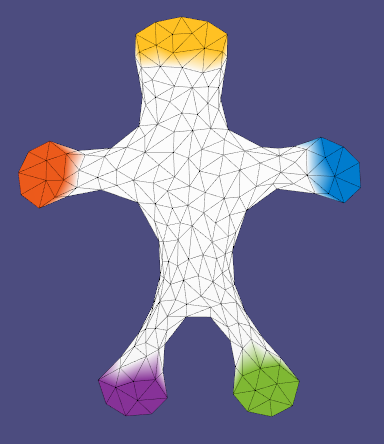
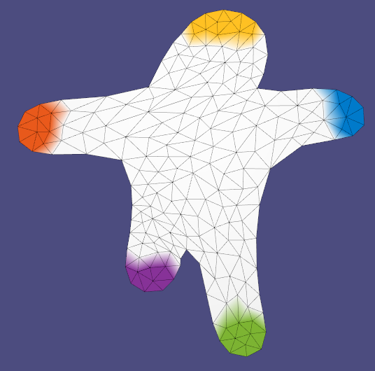
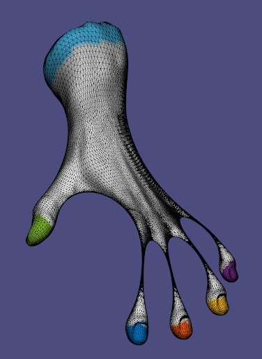

# Assignment 5

Name: 'Noureddine Gueddach'

Legi-Nr: '18-804-880'

## Required results
Edit this 'README.md' file to report all your results. You only need to update the tables in the reports section by adding screenshots and reporting results.

### Tasks

1) **Multiresolution Mesh Editing**: Provide screenshots for 4 different deformed meshes (woody-lo, woody-hi, hand, and cylinder). For each example, provide a rendering of S, B, B' and S'. (questions 1.1 - 1.4 of the assignment sheet)

2) **Real time mesh editing**: Provide animated gifs or short videos for 4 different deformed meshes (bar, bumpy_plane, camel_head, and cactus) showing that your algorithm can perform in real time. (question 1.5 of the assignment sheet)

3) **Deformation transfer**: Discuss and show the differences to the results obtained with the high-frequency detail transfer from part 1.4. on 4 different meshes (bar, bumpy_plane, camel_head, and cactus). (part 2 of the assignment sheet)

## Reports
### 1.1 - 1.4 Multiresolution Mesh Editing
| model name     | S     |  B    |  B'   |  S'   |
| :-----------:  | ----- | ----- | ----- | ----- |
| woody-lo       ||  ||  |
| woody-hi       ||  ||  |
| hand           ||  ||  |
| cylinder       ||  ||  |

### 1.5 Real time mesh editing

Show real time mesh editing using animated gifs or short videos. *Max 15 seconds per gif, better if 5 to 10 seconds*.

| model name     |   S' - real time   |
| :-----------:  | -----  |
| bar            |  |
| bumpy_plane    |  |
| camel_head     |  |
| cactus         |  |

### 2 Deformation transfer
| model name     | High-freq detail transfer             | Deformation transfer                 |
| :-----------:  | ------------------------------------- |------------------------------------- |
| bar            ||  |
| bumpy_plane    ||  |
| camel_head     ||  |
| cactus         ||  |

#### Observations

|      | High-freq detail transfer             | Deformation transfer                 |
| :-----------:  | ------------------------------------- |------------------------------------- |
| Your Comments  |High-freq detail transfer tends to produce self-intersections (as can be seen in the bumpy plane), some weird curvatures (as can be seen in the bar and the cactus), as well as high geometry distortion artifacts (as can be seen on the camel's forehead and some parts of the cactus).                    | Deformation transfer on the other hand avoids these pitfalls, preserves geometry much better (the high deformation of the camel's mouth nicely preserves the camel's eyes geometry for example), avoids self-intersections and yields overall smoother meshes, as can be seen on all the models. Something that can be noticed as well is that this method seems to preserve smoothness by making some areas thinner (like a rubber), this is very visible on the cactus' elongated arm and the camel's nose). From a runtime point of view, I did not notice any significant difference.         |

