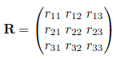
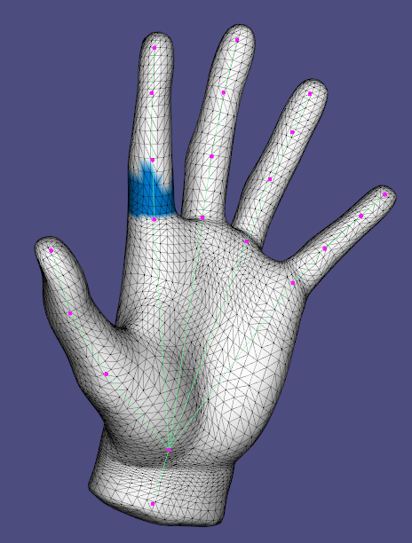
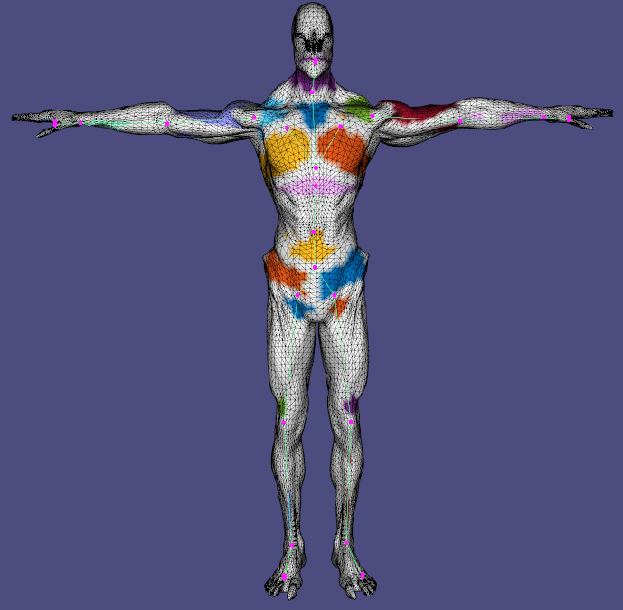
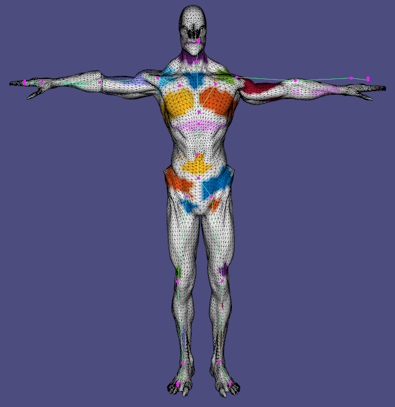

# Assignment 6: Skinning & Skeletal Animation

## Report

### Task 2: Rotation Representation discussion
#### Task 2.1. compare different rotation representations

| Representions        |  Short Description  |     pros            |      cons           |
| :------------------: |:------------------: |:------------------: |:------------------: |
| rotation matrix      | The rotation is encoded using 9 numbers arranged in a 3x3 orthogonal matrix with determinant 1. To rotate some vector, it suffices to multiply the rotation matrix by the vector.              | Matrices are ubiquitous and can be integrated pretty much anywhere. Makes use of readily available matrix multiplication.               |     Over-parametrization. Numerical drifts require expensive re-orthogonalization. Not impossible to directly interpolate matrices. Matrix entries do not carry intuitive information.             |
| euler angles         | The rotation is encoded using 3 numbers, representing rotation amount around x, y and z axis respectively. Rotation order is important.              |Intuitive. Only require 3 parameters. No need for any renormalization.               | Singularity at 2$\pi$ ($2\pi$=0). There are many ways to represent the same rotation. Gimbal-locks: loss of 1 DOF when 'locked' and very unstable interpolation when near a lock configuration.              |
| axis angle           | The rotation is represented using 4 numbers, one for the amount of rotation and 3 for the axis of rotation.              | Intuitive and straight-forward interpretation.               | Hard to work with and need to convert to other representations. Discontinuity at $2\pi$. Cannot interpolate all 4 numbers (only the angle)              |
| quaternions          | The rotation is represented using 4 numbers              |Nice interpolation properties. Easy to retrive the angle and axis of rotation. Compact representation. Easy to use. No Gimbal-lock.             | Require renormalization to maintain unit length. Unintuitive.             |

#### Task 2.2. Theoretical question for dual quaternions

| Euler angles -> rotation  matrix |  rotation matrix -> quaternion  |    quaternion + translation -> dual quaternion   |
| :------------------------------: |:------------------------------: |:-----------------------------------------------: |
|  |  |   | 

<figure align="center"><figcaption align = "center"><b>Rotation around the x axis</b></figcaption></figure>

<figure align="center"> <figcaption align = "center"><b>Rotation Matrix to Quaternion</b></figcaption></figure>

### Task 3: animation of the skeleton
| from rotaton matrix  |  from quaternions   |
| :------------------: |:------------------: |
|   |  |

It is hard to see any difference between the 2 animations. However, the quaternion-based one only requires $4 \times \textit{nb links}$ values (for the end-pose) while the rotation matrices representation requires $9 \times \textit{nb links} \times \textit{nb frames}$ values which is a huge difference in storage requirement.

### Task 4: computing harmonic skinning weights on selected handles
#### Task 4.1. handle selection
| shape name           |  joint 1            |  joint 2            |  joint 3            |
| :------------------: |:------------------: |:------------------: |:------------------: |
| hand |   |  |  |

#### Task 4.2. skinning weights visualization
| shape name           |  joint 1            |  joint 2            |  joint 3            |
| :------------------: |:------------------: |:------------------: |:------------------: |
| hand |   |  |  |

### Task 5/6/7: skeletal animation 
| Task 5: per-vertex + rotation + Lerp   | Task 6: per-vertex + quaternion + Nlerp      | Task 7: per-face + quaternion + Slerp  |
| :---------:                            |        :---------:                           |       :---------:                      |
|  |  |    |

*It's important to note here that the results are **heavily** dependent on the handles.*

| Task 5: per-vertex + rotation + Lerp   | Task 6: per-vertex + quaternion + Nlerp      | Task 7: per-face + quaternion + Slerp  |
| :---------:                            |        :---------:                           |       :---------:                      |
| In this setting, the rotation matrices and translations are directly interpolated using the skinning weights. While this is fine for the translations, this operation is not well-defined for rotation matrices which may lead to artifacts. In practice however, the obtained result is still nice. As can be noticed, the central bones of the hand do not move much, which gives somewhat undesirable deformations at the top of the palm. A lot of work has been put into making sure the palm handles do not extend all the way up to the fingers, which reduces artifacts and self-intersections.            | This time, the interpolation is done in quaternion space, but since it is not spherical, the obtained quaternion is typically not normalized anymore, and so one needs to bring it back to the unit-quaternion space, which could be slightly more expensive. In practice, the results obtained using this and previous method are almost identical. One noticeable difference is that the knuckles seem to get slightly more inflated, making them look more like articulations, which is gives pretty nice visuals for this particular mesh. On a side note, for the alien guy, this scheme removes some shrinking artifacts presents at the shoulder when using the previous method.           | This version is mathematically better founded, since we perform rotation interpolation in log-quaternion space. Contrary to the 2 previous methods, computing the new vertex positions is more involved and the hand feels way less rigid, since all vertices move (because vertex position constraints are implicitely formulated using the gradient information), which in turn makes it feel more alive. Everything is smoother, there are no artifacts between the handles areas anymore and we have no self-intersections. On the flipside, the overall hand seems to shrink a tiny bit and the skin follows the underlying bones a bit more loosely (e.g. the pinky finger gets displayed a little bit).             |

### Task 8.1: context-aware per-vertex LBS
#### Task 8.1.1 visualize the unposed example shapes
| shape name           |  pose 1             |   pose 2            |   pose 3            |   pose 4            |
| :------------------: |:------------------: |:------------------: |:------------------: | :------------------: |
| human |   |  |  |  |

#### Task 8.1.2 skeletal animition using context
| without context   | with context     | 
| :---------:                            |        :---------:                           |  
|  |  |

Using examples significantly changes the skinning of the upper-body to better reflect how the muscles move under the skin and how they deform it. A disadvantage is that it seems to slightly shrink part of the shoulder.

For this part, I implemented 3 different kernels: Gaussian, Polyharmonic ($r^3$) and the Thin Plate kernel. While the latter 2 work well in all tested configurations, the Gaussian kernel requires a large epsilon value when using the reference handles (there is no problem when using my own computed handles), probably due to numerical errors when computing the example weights. There are also some other scenarios where it does not work very well and hence using the 2 other kernels is recommended.

### Task 8.2 (**bonus**): context-aware per-face LBS
#### Task 8.2.1 visualize the unposed example shapes
| shape name           |  pose 1             |   pose 2            |   pose 3            |   pose 4            |
| :------------------: |:------------------: |:------------------: |:------------------: | :------------------: |
| human |   |  |  |  | 

#### Task 8.2.2 skeletal animition using context
*Note that contrary to previous animations, I am using reference handles here because they are more dense. Indeed having too sparse handles at the forearm level leads to unwanted rotational deformations.*
| without context   | with context (Eq. 9)     | with context (Eq. 10)     | 
| :---------:                            |        :---------:                           |   :---------:                           |
|  |  |   |

#### Equation (9) vs. Equation (10):
While Equation 10 is mathematically speaking more correct than equation (9), it does not seem to bring any significant advantage visually. While the outputs are slightly different (Equation (10) makes the shoulders contract a little bit), it's virtually impossible to tell that one is better than the other. A big disadvantage of Equation (10) is that it's very slow due to the polar decomposition and it's the only part of this assignment that significantly degrades performance.

#### Per-vertex vs. Per-face context-based deformation:
Both approaches improve the visual output overall. While the per-vertex approach works very well with both dense and sparse handles, the per-face approach requires dense handles, as explained above. This is because per-face performs optimization over the whole mesh and tends to output much larger deformations. While this might be undesirable in some scenarios, it guarantees a highly smooth result, which is not the case for the per-vertex approach. The smoothness resulting from the per-face deformation also avoids self-intersections as a side-benefit. Furthermore, for this particular example, the mesh seems to keep a nice volume using per-face, while it loses some using the per-vertex approach, which leads to a few visual artifacts. Finally, per-face seems to benefit more from tha examples, since without them, the shoulders look a bit dislocated from the body. Per-vertex does not have this problem.
